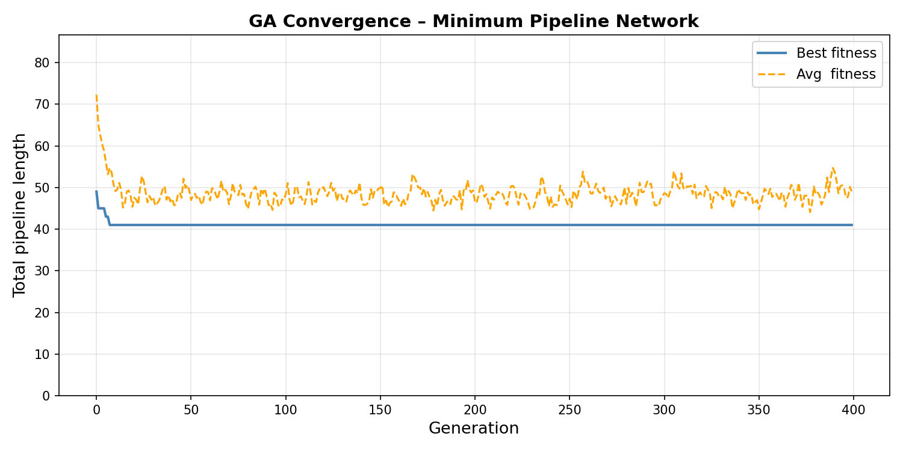
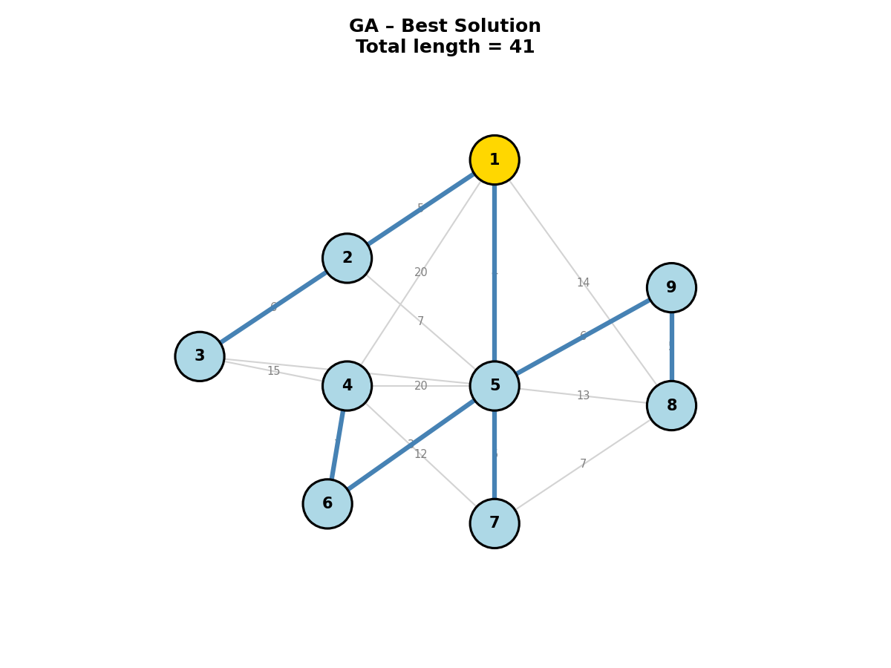

# GA Pipeline Network Optimization


A Genetic Algorithm that finds the minimum spanning tree for a pipeline network connecting oil well heads to a central delivery point. Built from scratch in Python using Prüfer sequence encoding — no graph optimization libraries used for the core solution.

 

Developed as part of graduate research in soft computing at the University of Cincinnati AI BIO Lab under Dr. Kelly Cohen.

 
---


## The Problem

 
Given a network of 9 nodes — 1 delivery point and 8 well heads — connected by edges of varying pipeline lengths, find the minimum spanning tree that connects all nodes with the lowest total pipeline length.
 

The challenge: naive approaches require evaluating an enormous number of possible spanning trees. A brute-force search over all possible trees for N nodes grows as N^(N-2), making it computationally intractable as the network scales. This is a classic optimization problem well-suited to a Genetic Algorithm.
 

---

 

## Results

 

| Metric | Value |

|--------|-------|

| Optimal total pipeline length | 41 |

| Generations to convergence | ~150 (of 400 run) |

| Population size | 120 |

| Crossover rate | 0.85 |

| Mutation rate | 0.15 |

| Elite size | 5 |

 

**Output plots:**

 





 

---

 

## How It Works

 

```

Network graph: 9 nodes, 17 edges with known distances

   │

   ▼

Population of Prüfer sequences (length N-2 = 7)

Each sequence maps bijectively to a unique spanning tree

   │

   ▼

For each individual:

   ├── Decode Prüfer sequence → edge list

   ├── Look up edge weights from adjacency dictionary

   ├── Fitness = total pipeline length

   └── Infeasible edges → infinity (filtered out)

   │

   ▼

GA operators:

   ├── Tournament selection (k=4)

   ├── Two-point crossover

   ├── Random-reset mutation

   ├── Repair function (replace infeasible genes)

   └── Elitism (top 5 carried unchanged)

   │

   ▼

Repeat for 400 generations → best sequence = minimum spanning tree

```

 

---

 

## Key Design Decision: Prüfer Sequence Encoding

 

The first approach attempted was binary edge-inclusion encoding: a binary string where each bit represented whether an edge was included in the tree. This created an immediate problem: most binary strings decode to invalid trees (cycles, disconnected graphs), requiring complex penalty functions and wasting compute on infeasible individuals.
 

The solution was Prüfer sequences. A Prüfer sequence of length N-2 has a bijective mapping to every possible labeled spanning tree on N nodes. This means that every sequence is a valid tree by construction. This eliminated the need for connectivity constraints entirely.

 

Infeasibility is still possible when a decoded edge does not exist in the original graph (not all node pairs are connected). This is handled by a repair function that randomly resets individual genes until all decoded edges are feasible, up to 200 attempts. This keeps the GA focused on optimizing feasible individuals rather than penalizing infeasible ones.

 

---

 

## GA Design Rationale

 

**Prüfer encoding** — bijective mapping from sequence to tree, no explicit connectivity constraints needed, no penalty functions required.
 

**Population size: 120** — large enough to maintain diversity on a 9-node graph (this was discovered through trial and error). A rough 100:1 ratio of population size to node count is a useful starting heuristic.

 

**Tournament selection (k=4)** — selective pressure without diversity collapse. No fitness scaling required.

 

**Two-point crossover (rate 0.85)** — preserves structural building blocks from both parents. High rate encourages exploitation of good solutions.

 

**Random-reset mutation (rate 0.15)** — each gene independently reset to a random valid node value. Maintains exploration on short sequences where standard Gaussian mutation is less meaningful.

 

**Elitism (top 5)** — best individuals carried unchanged into each generation, guaranteeing monotone improvement in best fitness. Too low and convergence slows; too high and diversity collapses.

 

**Repair over penalty** — infeasible individuals are repaired rather than penalized. The GA never wastes generations optimizing toward feasibility; it only optimizes individuals that are already feasible.

 

---

 

## Quickstart

 

**Clone**

```bash

git clone https://github.com/JetHayes/ga-pipeline-network-optimization.git

cd ga-pipeline-network-optimization

```

 

**Install**

```bash

pip install -r requirements.txt

```

 

**Run**

```bash

python ga_pipeline.py

```

 

Expected output:

```

============================================================

  Minimum Pipeline Network – Genetic Algorithm Solution

============================================================

 

[GA] Running …

[GA Result]    Total length = 41

  Annotated edges:

    1 --- 5  (length 4)

    5 --- 6  (length 3)

    ...

 

[Plotting]

  Convergence plot saved → results/convergence.png

  Network plot saved     → results/network.png

```

 

---

 

## Requirements

 

```

numpy

matplotlib

networkx

```

 

NetworkX is imported for graph utilities. The core adjacency lookups and spanning tree logic are implemented directly without relying on NetworkX's built-in MST solver.

 

---

 

## Scaling Challenges

 

This implementation works well for small networks but faces known limitations at scale (200+ nodes):

 

**Search space explosion** — the number of possible spanning trees grows as N^(N-2). At 200 nodes this becomes astronomically large, requiring a much larger population to maintain adequate coverage.

 

**Repair function breakdown** — at 200 nodes, the graph becomes sparse relative to all possible node pairs. A random gene reset is unlikely to land on a valid edge, making the repair function computationally expensive with no guarantee of success within a fixed attempt budget.

 

**Decoding cost** — decoding a Prüfer sequence at 200 nodes requires 199 edge weight lookups per individual per generation. Addressing this at scale would require vectorization, tensor operations, or more advanced data structures.

 

Potential solutions at scale include switching to edge-set encoding with smarter repair heuristics, applying local search (2-opt, 3-opt) as a post-GA refinement step, or moving to specialized MST metaheuristics designed for large graphs.

 

---

 

## Lessons Learned

 

The most important lesson was the encoding decision. Binary edge-inclusion encoding created an explosion of constraint-handling complexity. Switching to Prüfer sequences — once the bijective mapping property was understood — eliminated the problem entirely. Encoding choice has an outsized impact on GA performance, often more than hyperparameter tuning.

 

Repair functions outperform penalty functions for hard feasibility constraints. Penalties waste compute steering infeasible individuals toward feasibility; repair ensures the GA only ever optimizes individuals that are already valid.

 

Elitism size has a Goldilocks zone. Too small and good solutions are lost to noise; too large and diversity collapses, stalling convergence.

 

The GA converged to the optimal solution of 41 well before generation 400, suggesting the generation count could be reduced without sacrificing solution quality.

 

---

 

## Citation

 

```

John Cavanaugh, "GA Pipeline Network Optimization,"

University of Cincinnati AI BIO Lab, 2026.

GitHub: https://github.com/JetHayes/ga-pipeline-network-optimization

```

 

---

 

## License

 

MIT License. See `LICENSE` for details.

 

---

 

## Author

 

**[John Cavanaugh]**

PhD Candidate, Aerospace Engineering

University of Cincinnati — AI BIO Lab

Advisor: Dr. Kelly Cohen

 

[LinkedIn](#) · [Email](#)
